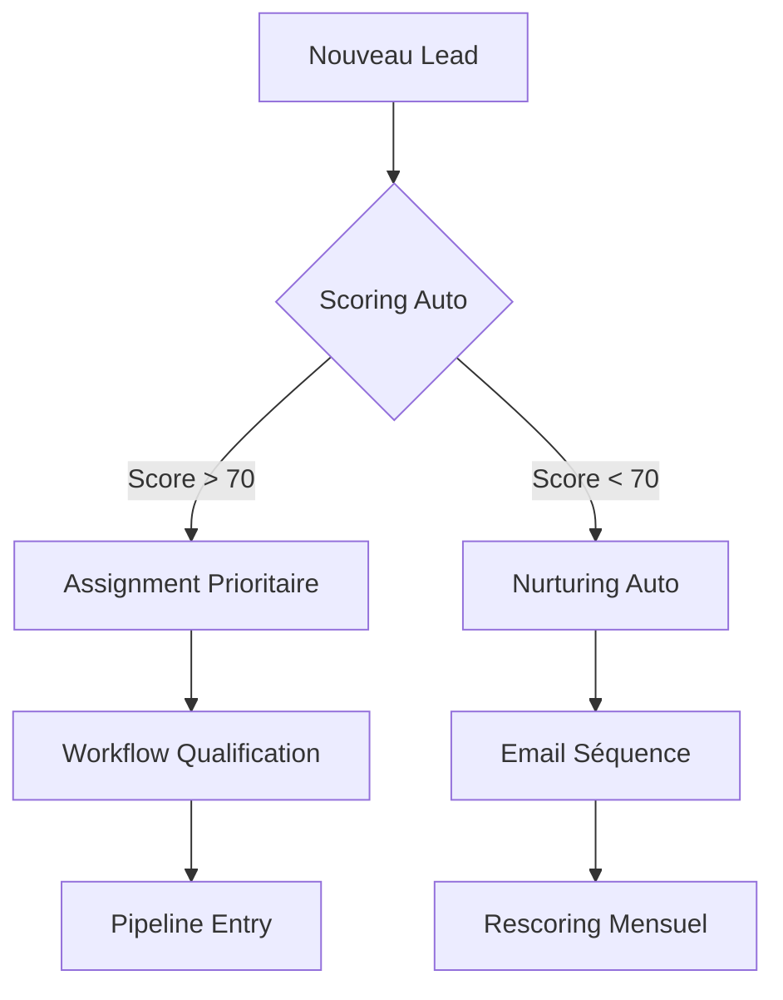
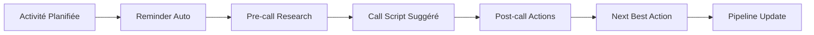
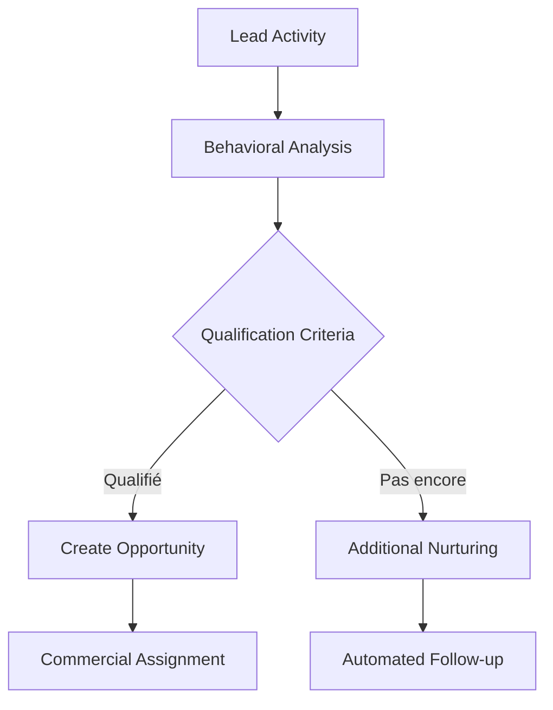
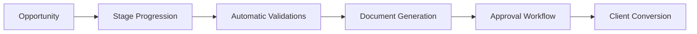
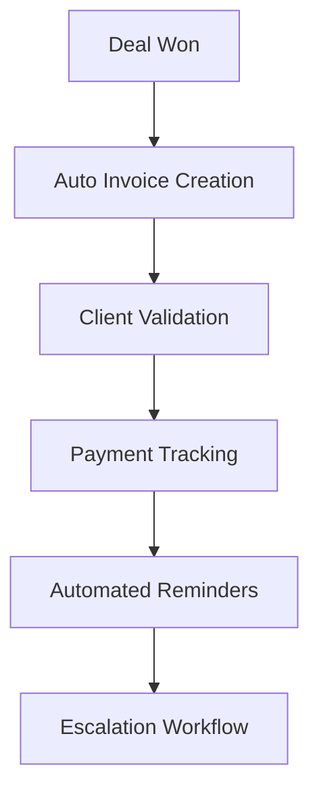

# Architecture CRM Orchestrée par n8n

## 🎯 Vision du CRM

Un système **intelligent** qui anticipe les besoins, automatise les tâches répétitives, et guide l'utilisateur dans ses actions avec des **workflows contextuels**.

## 🔄 Architecture de workflows n8n

### 1. PROSPECTION INTELLIGENTE



**Workflow n8n** :
- Trigger : Nouveau prospect dans Airtable
- Scoring automatique basé sur :
  - Taille entreprise
  - Secteur d'activité
  - Budget estimé
  - Historique interactions
- Assignment intelligent selon :
  - Charge de travail des commerciaux
  - Expertise secteur
  - Performance historique

### 2. SUIVI COMMERCIAL CONTEXTUEL



**Orchestration** :
1. **Pré-activité** : Recherche auto des dernières interactions
2. **Pendant** : Script contextuel basé sur l'historique
3. **Post-activité** : Suggestion automatique de next actions
4. **Intelligence** : Analyse du pattern pour optimiser le processus

### 3. QUALIFICATION AUTOMATED



**Règles intelligentes** :
- Analyse du comportement (ouverture emails, clics, durée calls)
- Scoring dynamique adaptatif
- Segmentation automatique
- Routing intelligent vers le bon commercial

### 4. PIPELINE DYNAMICS



**Orchestration avancée** :
- Validation automatique des critères de passage
- Génération auto des documents (devis, contrats)
- Workflows d'approbation multi-niveaux
- Conversion client seamless

### 5. FACTURATION INTELLIGENTE



**Smart Features** :
- Création automatique des factures
- Envoi conditionnel selon profil client
- Suivi intelligent des paiements
- Escalation progressive des rappels

## 🧠 Intelligence du système

### 1. MOTEUR DE RECOMMANDATIONS

```javascript
// Workflow n8n - Next Best Action
const nextBestAction = {
  triggers: ['lead_activity_completed', 'opportunity_updated'],
  analyze: {
    lastInteractions: true,
    clientHistory: true,
    pipelineStage: true,
    marketTrends: true
  },
  suggest: [
    'schedule_follow_up',
    'send_case_study',
    'invite_webinar',
    'schedule_demo',
    'propose_meeting'
  ]
}
```

### 2. SCORING DYNAMIQUE

```javascript
// Algorithme de scoring adaptatif
const leadScoring = {
  demographic: {
    company_size: 20,
    industry_match: 25,
    budget_range: 30
  },
  behavioral: {
    email_engagement: 15,
    content_consumption: 10,
    website_activity: 10
  },
  contextual: {
    timing: 10,
    competitive_analysis: 10,
    market_conditions: 10
  }
}
```

### 3. AUTOMATISATION CONDITIONNELLE

```javascript
// Workflow d'automatisation intelligent
const smartAutomation = {
  if: 'new_lead && score > 80',
  then: [
    'assign_to_senior_sales',
    'schedule_call_within_24h',
    'prepare_custom_pitch'
  ],
  else_if: 'new_lead && score > 50',
  then: [
    'add_to_nurturing_campaign',
    'send_welcome_sequence',
    'monitor_engagement'
  ]
}
```

## 🎭 Expérience utilisateur par rôle

### 1. COMMERCIAL (Vue Contextualisée)

**Dashboard Dynamique** :
- Prochaines actions prioritaires
- Pipeline avec next steps suggérés
- Alertes contextuelles
- Insights client en temps réel

**Workflow Type** :
```
Morning Routine:
1. Affichage des actions urgentes
2. Brief automatique des RDV du jour
3. Suggestions de follow-ups
4. Objectifs du jour vs progression
```

### 2. MANAGER (Vue Stratégique)

**Tableau de Bord Prédictif** :
- Forecast pipeline avec IA
- Performance équipe avec insights
- Alertes sur risques/opportunités
- Recommandations stratégiques

**Workflow Type** :
```
Weekly Review:
1. Analyse de performance automatique
2. Identification des goulots d'étranglement
3. Suggestions d'optimisation
4. Report exec auto-généré
```

### 3. DIRECTION (Vue 360°)

**Cockpit Décisionnel** :
- KPIs prédictifs
- Analyse comparative
- Tendances marché
- Recommandations stratégiques

### 4. ADMIN/OPS (Vue Processus)

**Centre de Contrôle** :
- Monitoring des workflows
- Optimisation des processus
- Gestion des intégrations
- Analytics d'utilisation

## 🔗 Intégrations Orchestrées

### 1. Email Intelligence

```yaml
email_workflow:
  trigger: email_received
  analyze:
    sentiment: true
    intent: true
    priority: true
  actions:
    auto_categorize: true
    suggest_response: true
    update_crm: true
    notify_if_urgent: true
```

### 2. Calendar Syncing

```yaml
calendar_workflow:
  trigger: meeting_scheduled
  prepare:
    - fetch_client_history
    - prepare_agenda
    - gather_documents
  during:
    - auto_note_taking
    - action_items_tracking
  after:
    - summary_generation
    - follow_up_scheduling
```

### 3. Document Intelligence

```yaml
document_workflow:
  trigger: contract_signed
  process:
    - extract_key_terms
    - update_opportunity
    - create_project
    - notify_delivery_team
```

## ⚡ Automatisations Clés

### 1. Lead Nurturing Multi-canal

```javascript
const nurturingCampaign = {
  triggers: ['lead_scored', 'behavior_change'],
  channels: ['email', 'linkedin', 'retargeting'],
  personalization: {
    content: 'based_on_interests',
    timing: 'based_on_engagement',
    frequency: 'based_on_preference'
  },
  intelligence: {
    stop_when: 'becomes_opportunity',
    escalate_when: 'shows_buying_signals'
  }
}
```

### 2. Pipeline Health Monitoring

```javascript
const pipelineMonitoring = {
  daily: {
    check_stuck_deals: true,
    predict_close_probability: true,
    suggest_interventions: true
  },
  weekly: {
    forecast_accuracy: true,
    performance_analysis: true,
    optimization_recommendations: true
  }
}
```

### 3. Client Success Orchestration

```javascript
const clientSuccess = {
  onboarding: {
    auto_schedule_milestones: true,
    track_adoption: true,
    identify_risks: true
  },
  ongoing: {
    usage_monitoring: true,
    satisfaction_tracking: true,
    expansion_opportunities: true
  }
}
```

## 🔄 Cycles d'amélioration

### 1. Apprentissage Continu

- Analyse des patterns de conversion
- Optimisation des workflows basée sur les résultats
- A/B testing automatique des processus

### 2. Feedback Loop

- Capture automatique du feedback utilisateur
- Ajustement des suggestions selon l'efficacité
- Evolution des scores et critères

### 3. Intelligence Collective

- Partage des meilleures pratiques entre commerciaux
- Capitalisation des succès
- Mise à jour des playbooks automatiquement

## 🎯 Résultats Attendus

1. **Productivité** : +40% d'efficacité commerciale
2. **Conversion** : +25% taux de conversion
3. **Satisfaction** : +30% satisfaction client
4. **Prédictibilité** : +50% précision des forecasts
5. **Autonomie** : 70% des tâches automatisées

## 🚀 Roadmap d'implémentation

**Phase 1** (Semaine 1-2) :
- Configuration de base n8n
- Workflows de scoring et d'assignment
- Intégration email basique

**Phase 2** (Semaine 3-4) :
- Pipeline intelligence
- Document automation
- Reporting avancé

**Phase 3** (Semaine 5-8) :
- IA prédictive
- Multi-canal orchestration
- Optimisation continue

**Phase 4** (Semaine 9+) :
- Intégrations avancées
- Personnalisation poussée
- Expansion des workflows
