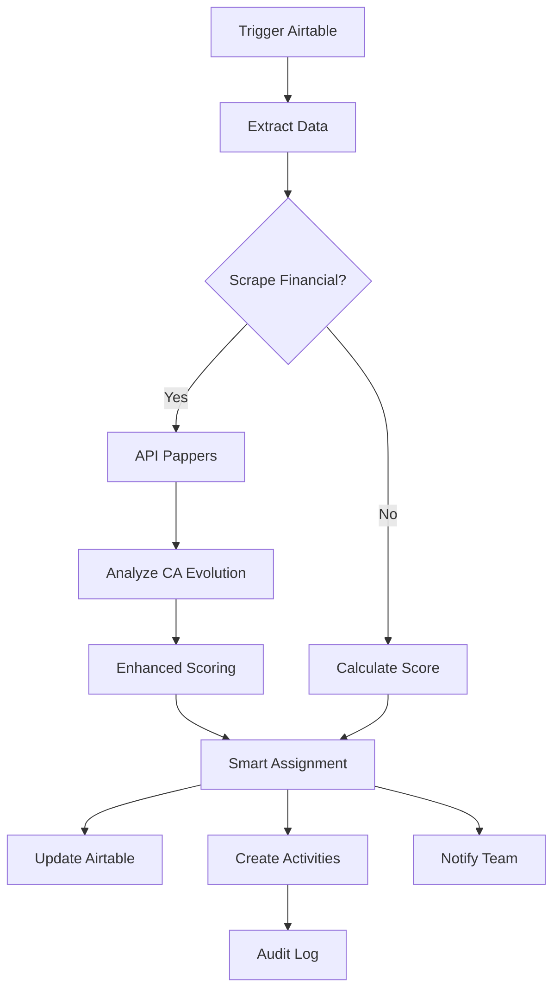

# Évolution des Workflows n8n

## 1. Lead Scoring & Assignment Workflow

### Version 1.0 (lead-scoring-workflow.json) - 10:30
**Objectif Initial** : Scoring et assignment basiques
```json
{
  "name": "Lead Scoring & Assignment",
  "concept": "Grandes entreprises prioritaires",
  "scoring": {
    "GE (250+)": 30,
    "ETI (51-250)": 20,
    "PME (11-50)": 15,
    "TPE (1-10)": 5
  },
  "industries": ["Technology", "SaaS", "Finance"],
  "assignment": "Round-robin simple"
}
```
**Problèmes identifiés** :
- Syntaxe template literals mal échappée
- Structure données incorrecte
- Paramètres Airtable obsolètes

### Version 1.1 (lead-scoring-workflow-fixed.json) - 10:40
**Objectif** : Corrections techniques
```javascript
// Corrections principales
if (items && items.length > 0 && items[0].json && items[0].json.fields) {
  data = items[0].json.fields; // Fix structure données
}

// Fix paramètres Airtable
"filterByFormula": "AND({is_active} = 'Actif', {department_id} = 'sales')"

// Fix gestion IDs
leadId: lead.uuid || lead.recordId,
leadRecordId: lead.recordId,
```

### Version 2.0 (lead-scoring-workflow-advanced.json) - 10:45
**Objectif** : Focus TPE/PME + Scraping financier

#### Changements majeurs :
1. **Scoring Inversé**
```javascript
case 'TPE (1-10)': score += 30; break;   // Nouvelle priorité
case 'PME (11-50)': score += 25; break;
case 'ETI (51-250)': score += 15; break;
case 'GE (250+)': score += 5; break;     // Minimisé
```

2. **Intégration APIs Financières**
```javascript
// Pappers API
"url": "https://api.pappers.fr/v2/entreprise",
"parameters": {
  "api_token": "YOUR_PAPPERS_API_TOKEN",
  "entreprise": "={{ $json.searchName }}"
}

// Fallback societe.com
"url": "https://www.societe.com/cgi-bin/search"
```

3. **Analyse de l'Urgence**
```javascript
if (currentCA > previousCA * 1.2) {
  caEvolution = 'strong_growth';
  urgency = 'high';
} else if (currentCA < previousCA * 0.9) {
  caEvolution = 'decline';
  urgency = 'high'; // Aussi urgent!
}
```

4. **Assignment Intelligent**
```javascript
if (lead.urgency === 'high') {
  // Chercher un commercial senior
  assignedRep = salesRepsList.find(rep => 
    rep.fields?.experience_level === 'senior'
  ) || salesRepsList[0];
}
```

## 2. Pipeline Health Monitor Workflow

### Description
**Fichier** : pipeline-health-workflow.json
**Fonction** : Surveillance quotidienne du pipeline

#### Fonctionnalités principales :
1. **Détection des Deals Bloqués**
```javascript
if (daysSinceUpdate > 7) {
  analysis.stuck_deals.push({
    uuid: opp.uuid,
    days_stuck: Math.round(daysSinceUpdate)
  });
}
```

2. **Analyse des Deals à Risque**
```javascript
if (opp.probability < 50 && daysToClose <= 14) {
  analysis.at_risk.push({
    uuid: opp.uuid,
    probability: opp.probability
  });
}
```

3. **Rapports Personnalisés**
- Manager : Vue consolidée
- Commercial : Actions spécifiques
- Direction : Métriques globales

## 3. Client Success Automation Workflow

### Description
**Fichier** : client-success-workflow.json
**Fonction** : Onboarding et suivi automatisés

#### Milestones Automatiques :
```javascript
const milestones = [
  { day: 1, title: "Welcome & Account Setup" },
  { day: 2, title: "Kickoff Call" },
  { day: 7, title: "First Week Check-in" },
  { day: 14, title: "Usage Review" },
  { day: 30, title: "Monthly Review" }
];
```

#### Métriques Success Tracking :
```javascript
success_metrics: {
  adoption_rate: { target: 80, unit: "%" },
  user_engagement: { target: 70, unit: "%" },
  support_tickets: { target: 2, unit: "count", direction: "less" },
  satisfaction_score: { target: 4.5, unit: "rating" }
}
```

## Comparaison des Versions

| Feature | v1.0 | v1.1 | v2.0 |
|---------|------|------|------|
| Scoring TPE | 5 pts | 5 pts | 30 pts |
| Scoring GE | 30 pts | 30 pts | 5 pts |
| Scraping CA | ❌ | ❌ | ✅ |
| Urgence | Basic | Basic | Avancée |
| Assignment | Round-robin | Round-robin | Intelligent |
| APIs | ❌ | ❌ | Pappers + Société.com |
| Error Handling | ❌ | ✅ | ✅ |

## Architecture des Workflows



## Logs des Modifications

### 2025-05-11 10:30
- Création workflow initial lead-scoring

### 2025-05-11 10:40
- Identification et correction des bugs
- Version fixed publiée

### 2025-05-11 10:45
- Refonte complète pour TPE/PME
- Ajout scraping CA
- Version advanced publiée

### 2025-05-11 10:50
- Documentation complète des workflows
- Sauvegarde dans repository

## Import Instructions

### 1. Préparation
```bash
# Cloner le repository
git clone https://github.com/agamemnonbros/database-schemas.git

# Naviguer vers les workflows
cd database-schemas/workflows
```

### 2. n8n Import
1. Ouvrir n8n
2. Créer nouveau workflow
3. Importer JSON
4. Configurer credentials
5. Tester manuellement

### 3. Configuration
```javascript
// Variables à remplacer
[YOUR_BASE_ID] → Votre ID Airtable
YOUR_PAPPERS_API_TOKEN → Token Pappers
```

## Backup Strategy

1. **Git Versioning** : Toutes versions sauvées
2. **Export JSON** : Disponible à tout moment
3. **Documentation** : Changelog détaillé
4. **Airtable** : Backup via API

## Prochaines Évolutions

1. **Machine Learning** : Scoring adaptatif
2. **Multi-Channel** : Intégration LinkedIn
3. **Predictive Analytics** : Probabilités closing
4. **Advanced Automation** : A/B testing intégré
